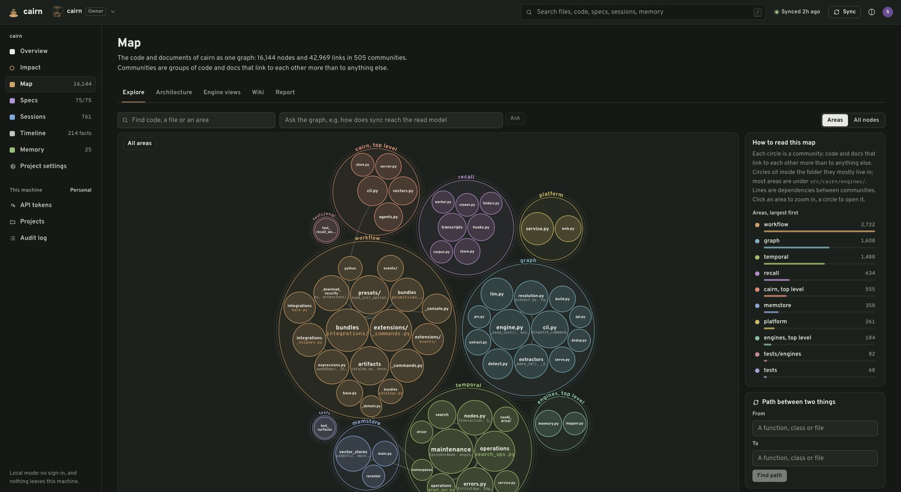
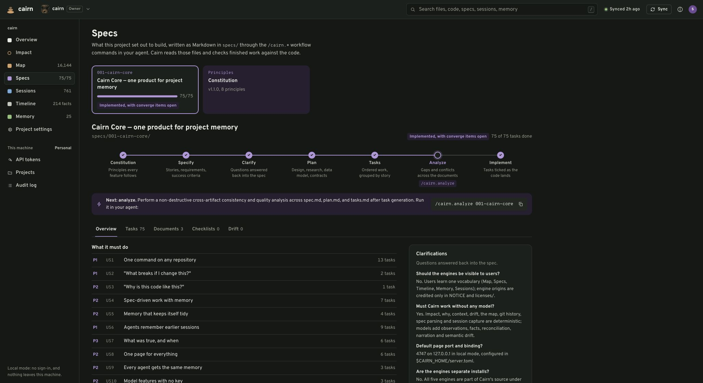
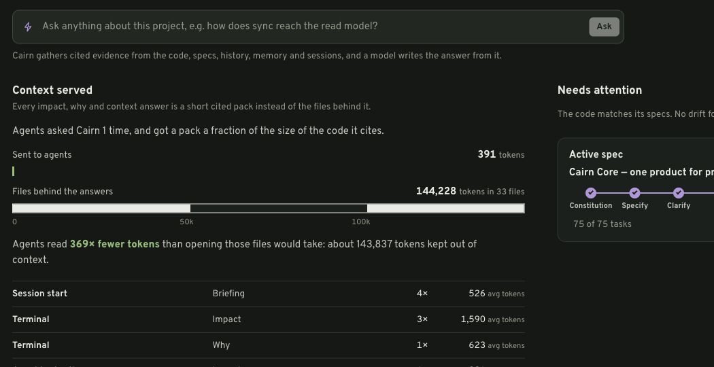

# Cairn onboarding: developer, Claude and team personas

Cairn is the repository in this portfolio that implements five relevant layers and a context-savings UI. The original project already has docs/onboarding.md. This companion guide explains a practical first session, what the screens mean, how to validate them, and where the savings interpretation needs care. The other repositories have their own onboarding files under reports/.

## 1. Start with a bounded task

Imagine a small service that retries payment-provider requests. A new developer must change the retry delay without duplicating payments. The code has an idempotency key, an ADR explaining it, a closed task and a previous reverted fix. Cairn is useful if it brings those pieces into the next coding session before the developer or Claude repeats the mistake.

The first-time user should use a disposable repository or intentionally register a project they own. Running `cairn` is setup, not just a viewer: it writes managed agent configuration, installs git hooks, initializes local stores and starts the server. Re-running setup is intended to be idempotent. Review the existing repository’s instructions and setup status before running it.

For the supplied Cairn checkout, the environment already exists. Start with `./.venv/bin/cairn doctor`. For a new installation, follow the source README’s `uv tool install cairn-brain` or `pipx install cairn-brain`, then run `cairn` from the target repository. Current registry availability was not checked during this review.

**Success looks like:** the project appears in the selector; a completed sync has a timestamp; doctor shows the map/spec/history/session capabilities and the per-agent hook status; Impact resolves a real file. A green screen alone is insufficient—open one cited file and verify the statement.

## 2. What the developer does versus what Claude does

| Moment | Developer action | Intended Claude behavior | Verify |
|---|---|---|---|
| Start work | Open the right repo/project and state a concrete task | Read the session-start brief if the configured hook provides it | Doctor’s Claude row; Sessions preview; visible tool activity |
| Before edit | Name the file or acceptance criterion | Call cairn_context for the task or cairn_impact for a target | Pack includes real citations and relevant tests/callers |
| Intent is unclear | Ask why the idempotency key exists | Call cairn_why instead of inventing a rationale | ADR, comment, history or memory supports the answer |
| Implement | Review scope and diff | Read the necessary source, change code, run appropriate checks | Working tests and actual source still matter after the summary |
| Learn a durable rule | Decide whether it is worth preserving | Call cairn_remember with a concise convention/decision/gotcha | Memory shows the right project, provenance and current text |
| Resume tomorrow | Open a new session in the same project | Receive recent context and search prior sessions when needed | The new session can find the saved decision without you restating it |

MCP registration makes tools available; the instructions block tells Claude when to use them; the session-start hook injects a brief automatically when supported. These are different mechanisms. A hook does not force later tool calls, and instruction text does not guarantee model compliance. If the tool is unavailable, Claude should disclose that and use source evidence rather than pretend it called Cairn.

Example prompt: “Before changing the retry delay, use Cairn to explain the idempotency constraint and show likely affected tests. Then make the smallest change and validate it.” Expected response: citations to the constraint, a scoped plan, an actual diff and test result. An answer consisting only of a graph summary is incomplete.

## 3. Map: what the code is

Captured during this review from the running local Cairn UI. It shows pre-existing indexed data, not a fresh accuracy benchmark.

Open **Map** from the rail. It starts with Areas: communities of connected code and documents grouped by their dominant folder. Circle size means node count, not importance or quality. The dependency threshold hides weaker connections; a missing line may be filtered out rather than absent from the index.

Click an area, then a community or member. For the payment example, locate the retry module and inspect its relation to the provider client. Use the path controls when you know both endpoints. Use **Impact** to ask what depends on the symbol before editing it.

- **Developer:** learn structure and verify a caller in source.
- **Claude:** use a budgeted impact/context pack to select the next files to inspect.
- **Tech lead:** look for architectural coupling, then validate it; large communities are not automatically bad design.
- **Validation:** one known import/call appears with the correct path. Check EXTRACTED versus INFERRED provenance. Co-change is a clue, not proof of a runtime call.
- **Failure mode:** a stale map can confidently describe an old commit. Check sync timestamp and source version before a risky change.

## 4. Specs: what was intended

Open **Specs**, select a feature, then inspect Overview, Tasks, Documents and Drift. The workflow is constitution → specify → clarify → plan → tasks → analyze → implement. The UI offers the next slash command; it does not make the implementation correct simply because boxes are checked.

For the payment example, the specification should say “a retry must not create a second payment,” with a task naming the implementation and test. Claude can use `cairn_specs` and the installed `/cairn.*` workflow to retrieve or maintain artifacts. The developer should compare the actual diff and test with the acceptance criterion before marking work complete.

**Observed example:** this Cairn project displayed 75/75 tasks and no drift, but Analyze was still shown as the next workflow stage. Treat progress counters as separate signals. Deterministic drift detects certain structural inconsistencies; a semantic bug can remain even when the drift count is zero.

**Validation exercise:** in a throwaway fixture, mark a task done that names a missing file, sync and inspect the finding. Restore the fixture afterward. Do not toggle real project tasks just to see whether a button works.

## 5. Timeline: what happened, and when it was true

Timeline combines history and optional temporal facts. Open the page, choose an entity or use its time control, and ask whether a statement was valid before or after a known change. A fact’s validity interval is different from the date it was ingested.

For example: “Retries were disabled until the provider supplied idempotency support; they became safe after the May change.” The developer checks the referenced commit or decision. Claude uses `cairn_facts` with the relevant date when investigating a regression against an older version.

**Without a model:** git history and deterministic relationships still provide context. Model-generated temporal facts are an additional feature, not the same thing as the raw commit log.

**Validation:** choose one known reversal, compare before/after dates and inspect the source. A fact with no reliable provenance should be labeled uncertain. More timeline facts do not necessarily mean a better timeline.

## 6. Memory: what the team learned

Open **Memory**. Choose a kind such as convention, decision or gotcha, and save one durable statement with scope. A useful example is: “Payment retries must reuse the original idempotency key; a timeout does not mean the provider rejected the payment.” Include a source when possible.

Cairn may add, merge, update or retire overlapping memories depending on its available reconciliation mechanism. Check the returned outcome and the retained wording. A model can merge incorrectly, so the user needs to be able to inspect history and correct it.

**Claude should store:** decisions with reasons, non-obvious failure modes, conventions that are not already reliably discoverable in code. **Claude should avoid storing:** every file read, transient task status, secrets, guesses or raw customer content.

**Validation:** search the statement with different wording; check project isolation and supersession; use `cairn memory check` to validate search-record consistency. Use its repair option only after understanding the mismatch. A viewer role should not be able to change team memory.

## 7. Sessions: what agents did

Open **Sessions** to inspect captured activity, observations, summaries and the “next session” preview. Capture hooks record events; a worker processes them. Model processing may be optional, queued, failed or deterministic. These are separate states.

For the payment example, the next session should see that the retry delay was changed, the idempotency key was preserved and the relevant tests passed. It should not receive the entire previous terminal transcript as unquestioned instructions.

**Validation:** start a harmless fixture session, read a file and finish a turn; check its recorded event and processing status. Then open a new session and check the brief. An empty preview can mean no useful captured data, unsupported/unapproved hooks, the wrong project, or a worker problem. Doctor and queue errors help distinguish them.

**Cost control:** `[recall] worker_spawn = false` queues rather than automatically processing work; `[deep] enabled = false` disables deep temporal enrichment. Review docs/models-and-cost.md and the model ledger before enabling background model use. The inspected UI’s “local mode” wording should not be interpreted as a guarantee that configured remote model calls keep source data on-device.

## 8. Read the savings panel correctly

The screenshot is a crop of the actual Overview, captured on 2026-09-26. It shows existing records: **391 estimated tokens sent** versus **144,228 estimated source tokens across 33 files**. The displayed 369× comparison is approximately 144,228 ÷ 391. The difference is 143,837 estimated tokens, and the relative reduction is about 99.73% **against reading all those cited files**.

That baseline is useful but hypothetical. It does not establish that an agent otherwise would have opened all 33 files, that the answer was sufficient, or that no later source reads occurred. Token estimates use file size divided by four in `Cairn.source_cost`, not the billing tokenizer for every model/language.

Keep four measures separate:

| Measure | Meaning | What it does not prove |
|---|---|---|
| Context-pack compression | Source-file estimate compared with delivered pack estimate | Actual avoided reads or billed dollars |
| Session compression | Stored raw activity versus observations/summaries | That the entire raw history would be reread every session |
| Added context and enrichment cost | Briefing tokens, schemas, model processing and storage | Automatically negative or positive ROI |
| Task outcome | Total actual tokens/cost/time to an accepted solution | Causality without comparable tasks and quality checks |

**UI scope nuance:** Overview prefers non-brief MCP rows when any exist, otherwise other non-brief rows. Briefings are displayed as added cost with no file baseline. The file count is derived from a limited recent-query list while token totals aggregate more broadly; it is not necessarily a lifetime unique-file count. Repeated queries can include the same source files.

For a realistic experiment, run matched tasks with and without Cairn and record all model usage, extra source reads, enrichment calls, elapsed time, review minutes and acceptance quality. Hold repository, task difficulty and model reasonably constant. A proposed cost formula is: baseline task cost − Cairn-assisted task cost − attributable enrichment/infrastructure cost. Do not count the same tokens in both the assisted bill and an extra overhead term.

Illustration only: if a matched baseline task costs $1.20, the assisted task costs $0.65 including its brief and follow-up reads, and enrichment attributable to that task costs $0.10, net reduction is $0.45, or 37.5%. These numbers are hypothetical inputs, not measured Cairn results or current model prices.

## 9. Persona-specific first week

| Persona | Start here | Repeated habit | Success evidence |
|---|---|---|---|
| Solo developer | Doctor → Impact → Memory | Check risky edits; record one durable gotcha | Fewer repeated mistakes at equal test quality |
| New team member | Map → Specs → Why | Trace one real change from requirement to code | Can explain and safely modify an unfamiliar area |
| Tech lead / reviewer | Impact → Specs → Sessions | Compare proposed scope with evidence and actual diff | Lower review rework, not just fewer read tokens |
| Team admin | Team setup → project roles → audit | Validate least privilege, retention and failed syncs | Unauthorized reads/writes fail; recovery procedure works |
| Finance / engineering manager | Overview + model ledger + task study | Compare total cost per accepted task | Net measured cost/time benefit with uncertainty stated |
| Claude / coding agent | Injected brief → context tool → source → tests | Cite evidence; preserve durable learning | Useful context is actually consumed; no invented tool calls |

## 10. A sign-off checklist

- The right project and source version are selected.
- Doctor shows the configured capture/injection path; any manual agent approval is resolved.
- A known symbol and caller can be verified through Map/Impact.
- A requirement links to real code and a meaningful test.
- A session is captured and the next-session preview is current.
- A memory can be retrieved and corrected in a disposable fixture.
- A failed provider or sync produces a visible degraded state.
- Savings are labeled as estimates with scope and baseline; the model ledger is understood.
- Team mode is separately checked for authentication, project access and audit behavior.

The review exercised existing UI reads and selected local tests. It did not perform these mutation exercises on your real project or certify a team deployment. Use this checklist to produce the missing evidence on a fixture.
