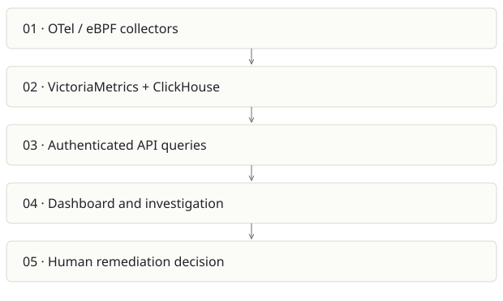

# OBSERVE

**Recommendation:** Distinct buyer and highest operational stakes; keep a separate product boundary.

| Snapshot | Assessment |
|---|---|
| Supplied location ID | OBSERVE |
| Product family | Operations |
| Implementation stage | Broad observability implementation |
| Review date | 2026-09-26 |
| Local state | local changes present |

## Vision and the problem it addresses

Provide self-hosted Kubernetes telemetry and AI-assisted investigation from one installation, with clear visibility into infrastructure and cost.

**Who needs it:** SREs, platform engineers and teams operating Kubernetes clusters.

**The moment it becomes useful:** An incident requires jumping among metrics, logs, traces and infrastructure views, while hosted telemetry costs grow with volume.

## How it works

This diagram summarizes the inspected design. It is not evidence of a successful end-to-end deployment. For a hands-on journey, use the [onboarding guide](ONBOARDING.md).

## How well it addresses the problem

- The inspected metrics route authenticates, validates query input, handles upstream errors and caches results.
- The repository combines runtime Helm infrastructure with UI, MCP tools and investigation code.
- Metrics/logs/traces use specialized established backends rather than a custom telemetry database.

These are implementation strengths. Repeated use, customer demand and measured business outcomes remain separate questions.

## What is missing or unproven

- Auth at the route is not proof of tenant or project isolation. The sampled instant-query route forwards supplied PromQL and has a query/time cache key without visible project identity; trace upstream scoping before using it for hard multitenancy.
- eBPF permissions, kernel compatibility, retention and backend sizing affect whether a one-install promise holds on a customer cluster.
- An AI explanation is not a verified root cause. Safe remediation needs evidence, bounded actions and rollback.
- Potential waste estimates are not realized bill savings. No cluster rollout, attack test or live incident drill was performed here.

## Smallest useful next step

Run a repeatable incident drill on a disposable cluster: inject one latency fault, compare manual and assisted diagnosis, check evidence, time to recovery and false leads.

**Acceptance exercise:** Trace a single synthetic request through metrics/logs/traces. Verify stale/no-data states, cross-project access denial, retention behavior and alert delivery in a sandbox. Validate dashboard costs against a known resource allocation.

This is a proposed validation exercise unless explicitly recorded as executed in [VALIDATION](../../VALIDATION.md).

## Position in the portfolio

Related work: [FreeLLMAPI](../free/REPORT.md), [Foundry / AI SDLC](../aisdlc/REPORT.md), [Spreix Platform](../spreix-platform/REPORT.md).

Read the [overlap and integration decisions](../../portfolio/SYNTHESIS.md) before merging features. Shared vocabulary does not guarantee shared IDs, permissions, storage or lifecycle semantics.

| Reviewer judgment, 1–5 | Score |
|---|---|
| Effort to a credible narrow pilot | 4 |
| Potential breadth and recurrence of the need | 5 |
| Integration, operational and consequence exposure | 5 |

These are ordinal planning judgments, not completion percentages or a commercial valuation. Empty/archive projects should be parked rather than treated as active bets.

## Evidence and next reading

[Source references and snapshot limits](EVIDENCE.md) · [Developer / Claude onboarding](ONBOARDING.md) · [Portfolio synthesis](../../portfolio/SYNTHESIS.md)
