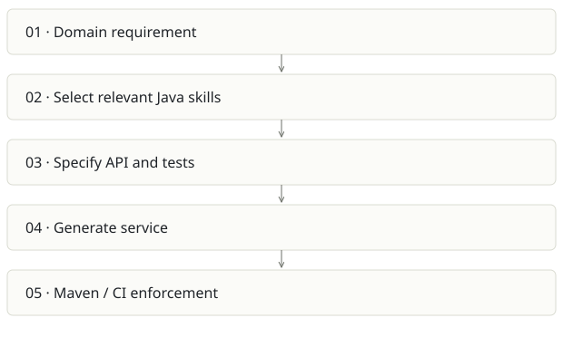

# Java AI governance scaffold

**Recommendation:** Useful internal standard; enforcement needs to catch up with prose.

| Snapshot | Assessment |
|---|---|
| Supplied location ID | ai-java-scaffold |
| Product family | Agent delivery |
| Implementation stage | Instruction pack + example |
| Review date | 2026-09-26 |
| Local state | clean |

## Vision and the problem it addresses

Make generated Java services follow the organization’s API, testing, observability and architecture conventions through reusable instructions.

**Who needs it:** Java platform teams, staff engineers and developers pairing with Claude or another coding assistant.

**The moment it becomes useful:** Each AI-generated microservice uses different dependencies, error formats and test practices, creating costly review and maintenance drift.

## How it works

This diagram summarizes the inspected design. It is not evidence of a successful end-to-end deployment. For a hands-on journey, use the [onboarding guide](ONBOARDING.md).

## How well it addresses the problem

- The repository has domain-specific skills rather than a giant empty application template.
- A runnable-looking greeting example demonstrates controller, strategy, service and ProblemDetail patterns.
- The POM configures JaCoCo line coverage and Spotless, giving a starting point for mechanical checks.

These are implementation strengths. Repeated use, customer demand and measured business outcomes remain separate questions.

## What is missing or unproven

- README guarantees about agent compliance are too strong: Markdown instructions cannot force correct output.
- The inspected example POM lacks Testcontainers, Maven Enforcer, a branch coverage threshold and Failsafe wiring; the example test is named GreetingControllerIT. Verify explicitly that the integration test is discovered.
- A simple greeting example does not demonstrate transactions, multitenant isolation, migrations or messaging reliability.
- The source remote belongs to an organization and README labels it proprietary. This atlas analyzes it; it does not republish the source or skills.

## Smallest useful next step

Build one reference service whose CI deliberately fails for a forbidden dependency, formatting violation, missed integration test and insufficient branch coverage.

**Acceptance exercise:** Inspect Maven test reports after verify; assert GreetingControllerIT actually ran. Seed one broken architectural dependency and one malformed API response and prove checks catch both. No Maven build was run in this review.

This is a proposed validation exercise unless explicitly recorded as executed in [VALIDATION](../../VALIDATION.md).

## Position in the portfolio

Related work: [Architecture Foundry](../archi-foundry/REPORT.md), [Foundry / AI SDLC](../aisdlc/REPORT.md).

Read the [overlap and integration decisions](../../portfolio/SYNTHESIS.md) before merging features. Shared vocabulary does not guarantee shared IDs, permissions, storage or lifecycle semantics.

| Reviewer judgment, 1–5 | Score |
|---|---|
| Effort to a credible narrow pilot | 1 |
| Potential breadth and recurrence of the need | 2 |
| Integration, operational and consequence exposure | 2 |

These are ordinal planning judgments, not completion percentages or a commercial valuation. Empty/archive projects should be parked rather than treated as active bets.

## Evidence and next reading

[Source references and snapshot limits](EVIDENCE.md) · [Developer / Claude onboarding](ONBOARDING.md) · [Portfolio synthesis](../../portfolio/SYNTHESIS.md)
