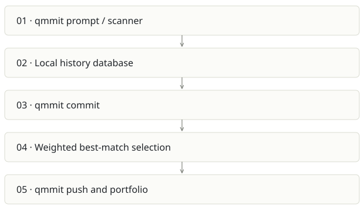

# Qmmit

**Recommendation:** Consolidate with Prompture rather than maintain two capture businesses.

| Snapshot | Assessment |
|---|---|
| Supplied location ID | aicommit- |
| Product family | Engineering evidence |
| Implementation stage | CLI + web implementation |
| Review date | 2026-09-26 |
| Local state | local changes present |

## Vision and the problem it addresses

Wrap git with prompt capture, privacy controls and prompt-to-commit attribution, then present a developer portfolio.

**Who needs it:** Developers who will adopt a git wrapper to record AI assistance; teams investigating code provenance.

**The moment it becomes useful:** People want to connect a prompt to a commit without manually maintaining a separate journal.

## How it works

This diagram summarizes the inspected design. It is not evidence of a successful end-to-end deployment. For a hands-on journey, use the [onboarding guide](ONBOARDING.md).

## How well it addresses the problem

- matchAllPrompts scores each prompt against commits and retains the highest candidate above the threshold.
- The CLI includes secrets/redaction, encrypted-sync-related code and multi-agent session scanning.
- Local-first prompt storage gives a useful control point before upload.

These are implementation strengths. Repeated use, customer demand and measured business outcomes remain separate questions.

## What is missing or unproven

- The matcher uses nested prompt×commit comparisons and any-typed records; scale and malformed payload behavior need validation.
- A 50-point threshold is not a calibrated probability or proof of contribution. Sequential session linkage can make ordering material.
- Replacing a habitual git command creates adoption friction; hooks may be easier, but require careful coexistence.
- The inspected local scanner has uncommitted changes and the remote belongs to pandey019. Attribution and ownership need preserving if code is reused.

## Smallest useful next step

Compare Qmmit and Prompture on the same capture corpus. Retain the stronger scanner/privacy pieces behind one versioned event schema and one user-facing identity.

**Acceptance exercise:** Use synthetic prompt/commit fixtures with unrelated changes, reordered events and redaction patterns. Verify repeated sync is idempotent and a plain git operation remains successful when capture fails. Existing tests were inspected by inventory, not executed.

This is a proposed validation exercise unless explicitly recorded as executed in [VALIDATION](../../VALIDATION.md).

## Position in the portfolio

Related work: [Prompture](../sovix-ai/REPORT.md), [Sovix CLI](../sovix-cli/REPORT.md), [Receipts](../github-2/REPORT.md).

Read the [overlap and integration decisions](../../portfolio/SYNTHESIS.md) before merging features. Shared vocabulary does not guarantee shared IDs, permissions, storage or lifecycle semantics.

| Reviewer judgment, 1–5 | Score |
|---|---|
| Effort to a credible narrow pilot | 2 |
| Potential breadth and recurrence of the need | 2 |
| Integration, operational and consequence exposure | 3 |

These are ordinal planning judgments, not completion percentages or a commercial valuation. Empty/archive projects should be parked rather than treated as active bets.

## Evidence and next reading

[Source references and snapshot limits](EVIDENCE.md) · [Developer / Claude onboarding](ONBOARDING.md) · [Portfolio synthesis](../../portfolio/SYNTHESIS.md)
