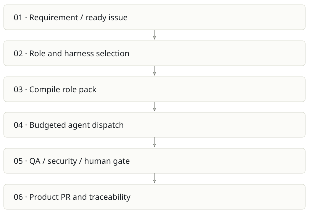

# Foundry / AI SDLC

**Recommendation:** Keep as an internal delivery system until independent products prove it.

| Snapshot | Assessment |
|---|---|
| Supplied location ID | aisdlc |
| Product family | Agent delivery |
| Implementation stage | Control plane implemented |
| Review date | 2026-09-26 |
| Local state | clean |

## Vision and the problem it addresses

Run a software-delivery organization through explicit work items, role packs, budgets and approval gates. Every agent action should leave a reviewable artifact.

**Who needs it:** Engineering organizations coordinating several agents; delivery leads; QA and governance owners.

**The moment it becomes useful:** An agent can write a feature, but nobody can reconstruct its requirement, review decision, cost or authority to merge. Handoffs between agents repeatedly lose context.

## How it works

This diagram summarizes the inspected design. It is not evidence of a successful end-to-end deployment. For a hands-on journey, use the [onboarding guide](ONBOARDING.md).

## How well it addresses the problem

- dispatch.yml separates the read-only control plane from the target product checkout and resolves products through policy, not arbitrary repository input.
- Harness compatibility is declared by each role pack; Claude Code and Codex are explicit dispatch choices.
- The repository contains tracker and memory adapters, ceremonies, dashboards and tests, so this is more than a prompt collection.

These are implementation strengths. Repeated use, customer demand and measured business outcomes remain separate questions.

## What is missing or unproven

- Several DoD entries remain enforced:false. A documented rule has no effect until the check and branch protection both enforce it.
- Agents accepting maintainer-labeled issue text still need prompt-injection boundaries and constrained credentials. The ready label is a gate, not sanitization.
- Self-hosting demonstrates mechanics, not broad economic advantage. Measure accepted delivery time, review load and rework on external pilot products.
- Operational role breadth makes support expensive; credential and workflow-scope mistakes can affect every downstream product.

## Smallest useful next step

Run ten small stories in a separate pilot product with frozen acceptance criteria. Track first-pass acceptance, human intervention minutes, retries and total cost per accepted story.

**Acceptance exercise:** Use synthetic unit fixtures for pack compilation and gates. In a sandbox GitHub repository, prove an unauthorized labeler, unsupported harness, missing trailer and exhausted budget each prevent dispatch or merge. Do not use the production control plane for experiments.

This is a proposed validation exercise unless explicitly recorded as executed in [VALIDATION](../../VALIDATION.md).

## Position in the portfolio

Related work: [Foundry Stage 0 seed](../foundry-stage0/REPORT.md), [Architecture Foundry](../archi-foundry/REPORT.md), [Java AI governance scaffold](../ai-java-scaffold/REPORT.md), [Cairn](../cairn/REPORT.md), [Receipts](../github-2/REPORT.md).

Read the [overlap and integration decisions](../../portfolio/SYNTHESIS.md) before merging features. Shared vocabulary does not guarantee shared IDs, permissions, storage or lifecycle semantics.

| Reviewer judgment, 1–5 | Score |
|---|---|
| Effort to a credible narrow pilot | 3 |
| Potential breadth and recurrence of the need | 5 |
| Integration, operational and consequence exposure | 5 |

These are ordinal planning judgments, not completion percentages or a commercial valuation. Empty/archive projects should be parked rather than treated as active bets.

## Evidence and next reading

[Source references and snapshot limits](EVIDENCE.md) · [Developer / Claude onboarding](ONBOARDING.md) · [Portfolio synthesis](../../portfolio/SYNTHESIS.md)
