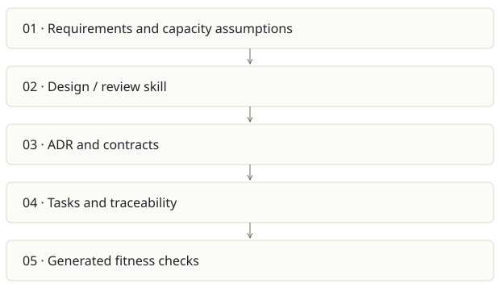

# Architecture Foundry

**Recommendation:** High-value companion to delivery tools; small distribution surface.

| Snapshot | Assessment |
|---|---|
| Supplied location ID | archi-foundry |
| Product family | Agent delivery |
| Implementation stage | Claude plugin / knowledge pack |
| Review date | 2026-09-26 |
| Local state | not a git checkout |

## Vision and the problem it addresses

Give Claude a repeatable architecture discipline: quantify requirements, compare alternatives, document decisions and turn important rules into falsifiable checks.

**Who needs it:** Architects, technical leads and developers designing or reviewing a system.

**The moment it becomes useful:** An attractive architecture diagram hides missing capacity assumptions, failure analysis and rejected options. Teams repeatedly debate the same choices.

## How it works

This diagram summarizes the inspected design. It is not evidence of a successful end-to-end deployment. For a hands-on journey, use the [onboarding guide](ONBOARDING.md).

## How well it addresses the problem

- Plugin manifest and ten skills have a concrete scope; the product is primarily instructions and curated knowledge.
- The bundled test-drive report records an audit, spec exercise and fail/pass/waived-pass checks, including defects found during testing.
- An audit-to-fitness-check workflow can produce durable enforcement rather than another document.

These are implementation strengths. Repeated use, customer demand and measured business outcomes remain separate questions.

## What is missing or unproven

- The test-drive is historical evidence, not a newly rerun benchmark or proof across many codebases.
- Prompt discipline depends on model behavior; generated checks need precision/recall and an intentionally violating fixture.
- The plugin homepage uses a different owner spelling from the requested personal account and the supplied directory is an unpacked bundle without git history.
- It overlaps with Foundry role packs and Cairn’s spec workflow. Reuse skills without creating conflicting instructions.

## Smallest useful next step

Publish one narrow, documented audit-to-check demo with a versioned fixture and repeatable outputs. Correct distribution metadata and define the boundary with Foundry.

**Acceptance exercise:** Run an architecture review on a disposable sample with a known outbound timeout flaw. Verify every finding cites a real line, then run the generated check on bad/good/waived inputs. Do not claim the historic test-drive was rerun.

This is a proposed validation exercise unless explicitly recorded as executed in [VALIDATION](../../VALIDATION.md).

## Position in the portfolio

Related work: [Foundry / AI SDLC](../aisdlc/REPORT.md), [Java AI governance scaffold](../ai-java-scaffold/REPORT.md), [Cairn](../cairn/REPORT.md), [Foundry Stage 0 seed](../foundry-stage0/REPORT.md).

Read the [overlap and integration decisions](../../portfolio/SYNTHESIS.md) before merging features. Shared vocabulary does not guarantee shared IDs, permissions, storage or lifecycle semantics.

| Reviewer judgment, 1–5 | Score |
|---|---|
| Effort to a credible narrow pilot | 1 |
| Potential breadth and recurrence of the need | 3 |
| Integration, operational and consequence exposure | 2 |

These are ordinal planning judgments, not completion percentages or a commercial valuation. Empty/archive projects should be parked rather than treated as active bets.

## Evidence and next reading

[Source references and snapshot limits](EVIDENCE.md) · [Developer / Claude onboarding](ONBOARDING.md) · [Portfolio synthesis](../../portfolio/SYNTHESIS.md)
