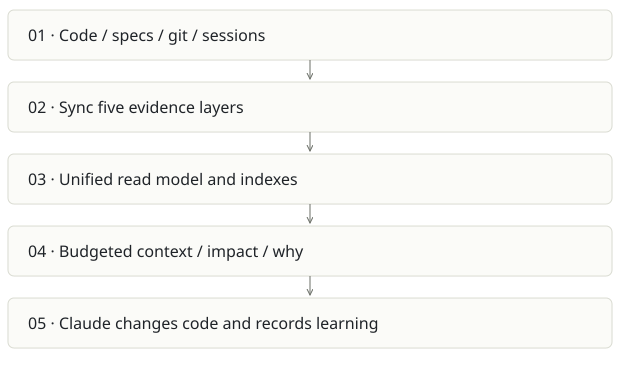

# Cairn

**Recommendation:** Strong developer-product candidate; validate outcomes beyond compression.

| Snapshot | Assessment |
|---|---|
| Supplied location ID | cairn |
| Product family | Agent memory |
| Implementation stage | Alpha with live UI |
| Review date | 2026-09-26 |
| Local state | clean |

## Vision and the problem it addresses

Give coding agents institutional memory: what the code is, what was intended, what changed, what the team learned and what past agents did. One CLI, MCP server and browser UI connect the five layers.

**Who needs it:** Solo developers restarting agent sessions; newcomers learning a repo; tech leads preserving decisions; admins serving team projects.

**The moment it becomes useful:** Claude repeatedly rediscovers the same code, forgets a reverted approach, or cannot explain why a constraint exists. A folder of notes has no link to the changed symbol or task.

## How it works

This diagram summarizes the inspected design. It is not evidence of a successful end-to-end deployment. For a hands-on journey, use the [onboarding guide](ONBOARDING.md).

## How well it addresses the problem

- Live local UI was inspected: Overview, Map and its navigation display populated graph, spec, session and memory counts.
- source_cost explicitly estimates source tokens from file bytes; query logging distinguishes delivery surface and briefing cost.
- The architecture includes deterministic context without a model, optional model enrichment, session hooks, MCP and team modes.
- Selected core/surface/agent-memory tests completed after two sandbox-only port failures were rerun successfully.

These are implementation strengths. Repeated use, customer demand and measured business outcomes remain separate questions.

## What is missing or unproven

- Compression is a proxy baseline, not measured avoided reading or invoice savings. Repeated packs can count the same files multiple times.
- The Overview headline switches to MCP totals when present; its file count uses recent rows while token totals cover the grouped history. This can confuse scope.
- Zero drift does not prove semantic correctness or test adequacy. Static edges and inferred co-change relationships have different certainty.
- Hook support differs by agent, and model-backed background processing can consume quota without a foreground question. Team production isolation and retention need deployment validation.

## Smallest useful next step

Package a 30-minute tutorial with a disposable repo and before/after task benchmark. Make baseline assumptions, model ledger and net cost visible beside the compression ratio.

**Acceptance exercise:** Run doctor; open Impact for a known symbol; check citations and a real caller; inspect the session-start preview; add and retire a harmless convention in a fixture; compare a task checked done with its actual file and tests. Measure total task tokens and elapsed time with and without Cairn.

This is a proposed validation exercise unless explicitly recorded as executed in [VALIDATION](../../VALIDATION.md).

## Position in the portfolio

Related work: [kb code graph](../kb/REPORT.md), [Architecture Foundry](../archi-foundry/REPORT.md), [Foundry / AI SDLC](../aisdlc/REPORT.md), [Spreix Brain](../spreix-brain/REPORT.md), [Prompture](../sovix-ai/REPORT.md).

Read the [overlap and integration decisions](../../portfolio/SYNTHESIS.md) before merging features. Shared vocabulary does not guarantee shared IDs, permissions, storage or lifecycle semantics.

| Reviewer judgment, 1–5 | Score |
|---|---|
| Effort to a credible narrow pilot | 2 |
| Potential breadth and recurrence of the need | 5 |
| Integration, operational and consequence exposure | 3 |

These are ordinal planning judgments, not completion percentages or a commercial valuation. Empty/archive projects should be parked rather than treated as active bets.

## Evidence and next reading

[Source references and snapshot limits](EVIDENCE.md) · [Developer / Claude onboarding](ONBOARDING.md) · [Portfolio synthesis](../../portfolio/SYNTHESIS.md)
