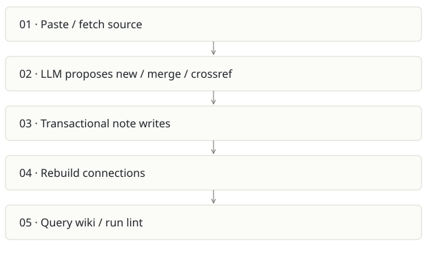

# Cortex / compiled wiki

**Recommendation:** Reuse the compiler; avoid a second broad team platform.

| Snapshot | Assessment |
|---|---|
| Supplied location ID | cortex |
| Product family | Team knowledge |
| Implementation stage | Implemented personal wiki |
| Review date | 2026-09-26 |
| Local state | clean |

## Vision and the problem it addresses

Compile sources into maintained concept notes once, then answer from the wiki. This emphasizes durable synthesis rather than retrieving raw document chunks afresh for every question.

**Who needs it:** Research-heavy individuals and small teams curating knowledge from links, repositories and pasted text.

**The moment it becomes useful:** Bookmarks grow while knowledge stays fragmented. Several sources discuss the same concept and need one evolving explanation with provenance.

## How it works

This diagram summarizes the inspected design. It is not evidence of a successful end-to-end deployment. For a hands-on journey, use the [onboarding guide](ONBOARDING.md).

## How well it addresses the problem

- applyIngestPlan wraps note mutations, source attribution, graph rebuilding and operation logging in a database transaction.
- Ingestion and brain packages separate fetching from synthesis, making the compiler a plausible reusable module.
- User-scoped note lookup is visible in the write path. Sources, notes and rules are distinct concepts.

These are implementation strengths. Repeated use, customer demand and measured business outcomes remain separate questions.

## What is missing or unproven

- The inspected cascade loop only calls touchBySlug. It marks related notes updated without actually regenerating their content; the README overstates cascade semantics.
- Compiled notes can propagate an early extraction mistake into future answers. Version history, conflict resolution and source deletion propagation need explicit acceptance tests.
- Personal userId scoping is not automatically compatible with Spreix Platform’s organization/brain permissions.
- Social ingestion depends on browser sessions; durability and supported access need separate validation.

## Smallest useful next step

Implement and test a real semantic cascade, or rename it to freshness marking. Prove source revision and deletion update every derived claim before exporting the compiler.

**Acceptance exercise:** Ingest two synthetic documents with a deliberate contradiction. Inspect raw sources, merged note, conflict flags, related note body and operation log. Delete/revise one source and verify the remaining answer cites valid evidence.

This is a proposed validation exercise unless explicitly recorded as executed in [VALIDATION](../../VALIDATION.md).

## Position in the portfolio

Related work: [Spreix Platform](../spreix-platform/REPORT.md), [Spreix Brain](../spreix-brain/REPORT.md), [Lumen](../ragpipeline/REPORT.md), [Scratch](../scratch/REPORT.md).

Read the [overlap and integration decisions](../../portfolio/SYNTHESIS.md) before merging features. Shared vocabulary does not guarantee shared IDs, permissions, storage or lifecycle semantics.

| Reviewer judgment, 1–5 | Score |
|---|---|
| Effort to a credible narrow pilot | 2 |
| Potential breadth and recurrence of the need | 3 |
| Integration, operational and consequence exposure | 3 |

These are ordinal planning judgments, not completion percentages or a commercial valuation. Empty/archive projects should be parked rather than treated as active bets.

## Evidence and next reading

[Source references and snapshot limits](EVIDENCE.md) · [Developer / Claude onboarding](ONBOARDING.md) · [Portfolio synthesis](../../portfolio/SYNTHESIS.md)
