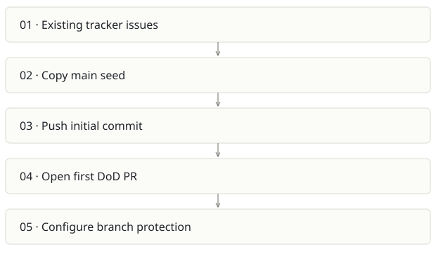

# Foundry Stage 0 seed

**Recommendation:** Archive as lineage of AI SDLC, not an additional product.

| Snapshot | Assessment |
|---|---|
| Supplied location ID | foundry-stage0 |
| Product family | Agent delivery |
| Implementation stage | Bootstrap archive |
| Review date | 2026-09-26 |
| Local state | not a git checkout |

## Vision and the problem it addresses

Bootstrap the first self-governing Foundry repository: seed its conventions, add a Definition-of-Done workflow and make that workflow a required merge check.

**Who needs it:** The initial control-plane maintainer recreating the project from a seed.

**The moment it becomes useful:** Before automation can enforce a rule, the rule and repository have to exist. Stage 0 makes that bootstrapping exception explicit.

## How it works

This diagram summarizes the inspected design. It is not evidence of a successful end-to-end deployment. For a hands-on journey, use the [onboarding guide](ONBOARDING.md).

## How well it addresses the problem

- bootstrap.sh makes manual seeding visible through commit trailers and has explicit steps to install the first gate.
- The split main/ and p0-1/ folders preserve the transition from ungoverned seed to governed change.

These are implementation strengths. Repeated use, customer demand and measured business outcomes remain separate questions.

## What is missing or unproven

- Only twelve files were inventoried; no full delivery runtime or dashboard exists here.
- The script creates remote commits and PRs and alters branch protection. It is not a read-only demo or safe to run against an existing repository without review.
- The more developed implementation exists under aisdlc/foundry-program. Maintaining both as live products would create policy drift.
- The script expects previously seeded issues; bootstrap is not a complete fresh-account installer.

## Smallest useful next step

Document it as an archived origin snapshot in the Foundry report. If reproducibility matters, add a dry-run fixture that validates generated files without remote writes.

**Acceptance exercise:** Read the script and compare generated seed/gate files to a fixture. A full verification requires a disposable GitHub repository and reviewed permissions. The script was not executed during this analysis.

This is a proposed validation exercise unless explicitly recorded as executed in [VALIDATION](../../VALIDATION.md).

## Position in the portfolio

Related work: [Foundry / AI SDLC](../aisdlc/REPORT.md), [Architecture Foundry](../archi-foundry/REPORT.md).

Read the [overlap and integration decisions](../../portfolio/SYNTHESIS.md) before merging features. Shared vocabulary does not guarantee shared IDs, permissions, storage or lifecycle semantics.

| Reviewer judgment, 1–5 | Score |
|---|---|
| Effort to a credible narrow pilot | 1 |
| Potential breadth and recurrence of the need | 1 |
| Integration, operational and consequence exposure | 2 |

These are ordinal planning judgments, not completion percentages or a commercial valuation. Empty/archive projects should be parked rather than treated as active bets.

## Evidence and next reading

[Source references and snapshot limits](EVIDENCE.md) · [Developer / Claude onboarding](ONBOARDING.md) · [Portfolio synthesis](../../portfolio/SYNTHESIS.md)
