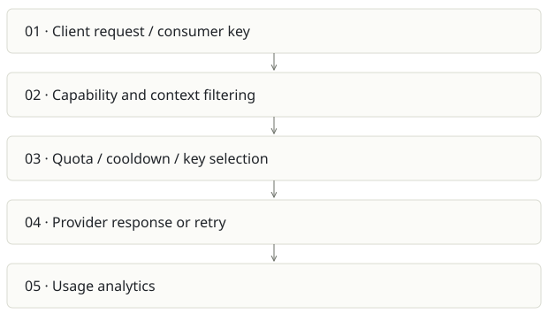

# FreeLLMAPI

**Recommendation:** Useful shared utility; reliability beats a “free forever” promise.

| Snapshot | Assessment |
|---|---|
| Supplied location ID | free |
| Product family | Knowledge infrastructure |
| Implementation stage | Gateway + admin implementation |
| Review date | 2026-09-26 |
| Local state | clean |

## Vision and the problem it addresses

Present multiple model providers behind one compatible endpoint, with health-aware routing, quotas, fallback and inspectable usage.

**Who needs it:** Developers experimenting with many providers; small deployments needing a consistent endpoint and basic cost control.

**The moment it becomes useful:** A prototype stops on provider limits or every app needs custom provider keys and fallback code.

## How it works

This diagram summarizes the inspected design. It is not evidence of a successful end-to-end deployment. For a hands-on journey, use the [onboarding guide](ONBOARDING.md).

## How well it addresses the problem

- routeRequest filters for vision/tools, consumer allowlists, context window and per-provider/key limits before selection.
- Bad key decryption is marked as an error and skipped; sticky routing and custom endpoints are explicit.
- Current source includes embeddings service, consumer controls and tests beyond the README’s original scope.

These are implementation strengths. Repeated use, customer demand and measured business outcomes remain separate questions.

## What is missing or unproven

- README says embeddings are unsupported while routes/UI/tests implement them. That contradiction can cause bad integration decisions.
- Provider free-tier availability and limits change; the gateway does not eliminate provider policy, latency or quality differences.
- Embedding fallback must preserve vector-space compatibility, not merely equal dimensions. Pin an embedding family for each collection.
- A gateway concentrates credentials and failures. At-rest encryption requires key backup/rotation and secret-safe logs; SQLite/process counters need deployment-scale evaluation.

## Smallest useful next step

Publish a tested compatibility matrix for chat, tools, Responses, vision and embeddings. Give each app a scoped consumer and pin embeddings rather than routing them like interchangeable chat models.

**Acceptance exercise:** Use mocked providers to force 429, timeout, invalid key, tool mismatch and oversized context. Verify clean exhaustion errors and no credentials in responses/logs. Run live provider checks separately with a budget.

This is a proposed validation exercise unless explicitly recorded as executed in [VALIDATION](../../VALIDATION.md).

## Position in the portfolio

Related work: [Lumen](../ragpipeline/REPORT.md), [Cairn](../cairn/REPORT.md), [Spreix Platform](../spreix-platform/REPORT.md), [OBSERVE](../OBSERVE/REPORT.md).

Read the [overlap and integration decisions](../../portfolio/SYNTHESIS.md) before merging features. Shared vocabulary does not guarantee shared IDs, permissions, storage or lifecycle semantics.

| Reviewer judgment, 1–5 | Score |
|---|---|
| Effort to a credible narrow pilot | 2 |
| Potential breadth and recurrence of the need | 3 |
| Integration, operational and consequence exposure | 3 |

These are ordinal planning judgments, not completion percentages or a commercial valuation. Empty/archive projects should be parked rather than treated as active bets.

## Evidence and next reading

[Source references and snapshot limits](EVIDENCE.md) · [Developer / Claude onboarding](ONBOARDING.md) · [Portfolio synthesis](../../portfolio/SYNTHESIS.md)
