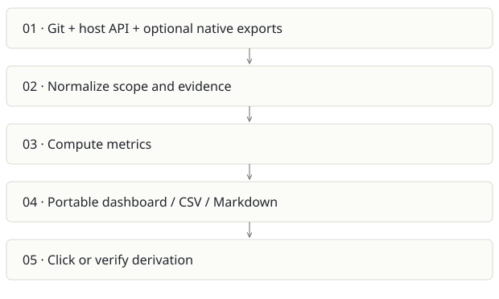

# Receipts

**Recommendation:** Best near-term evidence product; share methodology with Sovix CLI.

| Snapshot | Assessment |
|---|---|
| Supplied location ID | github-2 |
| Product family | Engineering evidence |
| Implementation stage | Beta CLI + portable dashboard |
| Review date | 2026-09-26 |
| Local state | local changes present |

## Vision and the problem it addresses

Give engineering leaders metrics that can be inspected all the way down to arithmetic, coverage and underlying records, without a model generating the numbers.

**Who needs it:** Engineering managers, CTOs, consultants and teams preparing evidence-based delivery reviews.

**The moment it becomes useful:** A dashboard gives a churn or AI-adoption number but nobody can reproduce its denominator, exclusions or source records.

## How it works

This diagram summarizes the inspected design. It is not evidence of a successful end-to-end deployment. For a hands-on journey, use the [onboarding guide](ONBOARDING.md).

## How well it addresses the problem

- The full local pytest invocation completed successfully in this review.
- The pipeline, metric definitions, evidence contract and no-AI dependency tests support its central promise.
- A self-contained dashboard and local demo lower the barrier to evaluating a leadership product.
- The supplied working tree includes specification-analysis changes; the report identifies this local snapshot rather than assuming they are published.

These are implementation strengths. Repeated use, customer demand and measured business outcomes remain separate questions.

## What is missing or unproven

- Git-derived delivery and AI signals remain proxies. Deployment frequency and change failure metrics need genuine deployment/incident data to mean DORA outcomes.
- Individual or key-person analysis has different privacy implications from Sovix CLI’s aggregate-only contract; do not merge outputs blindly.
- Large organizations need scoped outputs and incremental collection to avoid giant browser artifacts.
- README/package metadata still contains OWNER placeholders. Distribution and current hosted availability were not verified.

## Smallest useful next step

Sell or pilot a weekly evidence review for a small engineering team. The first deliverable should answer one disputed question with raw evidence and a stable window, not produce more charts.

**Acceptance exercise:** Run receipts demo locally, click one metric, recompute its formula from the cited fixture records, export CSV and rerender saved JSON. Verify incomplete host API coverage is visible and no model calls occur.

This is a proposed validation exercise unless explicitly recorded as executed in [VALIDATION](../../VALIDATION.md).

## Position in the portfolio

Related work: [Sovix CLI](../sovix-cli/REPORT.md), [Prompture](../sovix-ai/REPORT.md), [Qmmit](../aicommit-/REPORT.md), [Foundry / AI SDLC](../aisdlc/REPORT.md).

Read the [overlap and integration decisions](../../portfolio/SYNTHESIS.md) before merging features. Shared vocabulary does not guarantee shared IDs, permissions, storage or lifecycle semantics.

| Reviewer judgment, 1–5 | Score |
|---|---|
| Effort to a credible narrow pilot | 1 |
| Potential breadth and recurrence of the need | 4 |
| Integration, operational and consequence exposure | 2 |

These are ordinal planning judgments, not completion percentages or a commercial valuation. Empty/archive projects should be parked rather than treated as active bets.

## Evidence and next reading

[Source references and snapshot limits](EVIDENCE.md) · [Developer / Claude onboarding](ONBOARDING.md) · [Portfolio synthesis](../../portfolio/SYNTHESIS.md)
