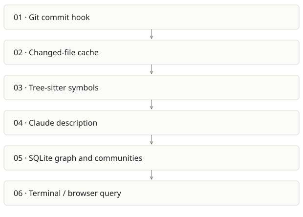

# kb code graph

**Recommendation:** Keep as a focused component or migration source for Cairn.

| Snapshot | Assessment |
|---|---|
| Supplied location ID | kb |
| Product family | Agent memory |
| Implementation stage | Small working implementation |
| Review date | 2026-09-26 |
| Local state | local changes present |

## Vision and the problem it addresses

Build a living file graph after commits using structural extraction, co-change and short Claude-generated descriptions.

**Who needs it:** Developers onboarding to an unfamiliar repository; maintainers exploring cross-file relationships.

**The moment it becomes useful:** File trees show containment but not the imports, co-change patterns and rationale needed to safely change a system.

## How it works

This diagram summarizes the inspected design. It is not evidence of a successful end-to-end deployment. For a hands-on journey, use the [onboarding guide](ONBOARDING.md).

## How well it addresses the problem

- The design separates extracted imports from inferred co-change; the graph makes uncertainty inspectable.
- Stat/hash caching reduces repeated analysis; descriptions are updated with diffs and previous context.
- The CLI makes hook ingestion best-effort so a graph failure does not automatically fail the user’s commit.

These are implementation strengths. Repeated use, customer demand and measured business outcomes remain separate questions.

## What is missing or unproven

- newIngestCmd logs configuration errors and returns success. That protects commits, but users need a visible health signal to detect stale graphs.
- Claude-backed descriptions can incur quota and summarize incorrectly. Static structure and narrated meaning must remain separable.
- Cairn covers this need plus specs, history and sessions; selling both to the same user without boundaries duplicates onboarding.
- No runtime benchmark or graph accuracy audit was completed here.

## Smallest useful next step

Expose freshness, last failed ingest and description cost prominently. Choose whether kb remains a minimal CLI or is maintained as a Cairn import/export adapter.

**Acceptance exercise:** In a disposable repo, change one import and commit; verify only changed files are reindexed, the edge updates and a failed Claude call appears as degraded status. Trace an extracted edge back to source.

This is a proposed validation exercise unless explicitly recorded as executed in [VALIDATION](../../VALIDATION.md).

## Position in the portfolio

Related work: [Cairn](../cairn/REPORT.md), [Spreix Brain](../spreix-brain/REPORT.md).

Read the [overlap and integration decisions](../../portfolio/SYNTHESIS.md) before merging features. Shared vocabulary does not guarantee shared IDs, permissions, storage or lifecycle semantics.

| Reviewer judgment, 1–5 | Score |
|---|---|
| Effort to a credible narrow pilot | 2 |
| Potential breadth and recurrence of the need | 2 |
| Integration, operational and consequence exposure | 2 |

These are ordinal planning judgments, not completion percentages or a commercial valuation. Empty/archive projects should be parked rather than treated as active bets.

## Evidence and next reading

[Source references and snapshot limits](EVIDENCE.md) · [Developer / Claude onboarding](ONBOARDING.md) · [Portfolio synthesis](../../portfolio/SYNTHESIS.md)
