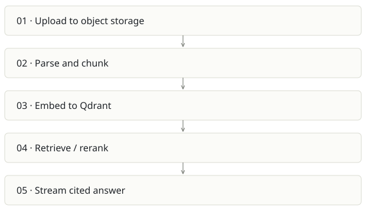

# Lumen

**Recommendation:** Choose as a standalone document platform only for a specific buyer need.

| Snapshot | Assessment |
|---|---|
| Supplied location ID | ragpipeline |
| Product family | Knowledge infrastructure |
| Implementation stage | Multi-service vertical slice |
| Review date | 2026-09-26 |
| Local state | local changes present |

## Vision and the problem it addresses

Make documents answerable through cited chat, an API and MCP, with self-hosted storage and configurable model providers.

**Who needs it:** Internal support teams, document-heavy organizations and developers embedding private knowledge search.

**The moment it becomes useful:** Answers must quote the original policy/manual passage, and raw document retrieval is more appropriate than maintaining a wiki.

## How it works

This diagram summarizes the inspected design. It is not evidence of a successful end-to-end deployment. For a hands-on journey, use the [onboarding guide](ONBOARDING.md).

## How well it addresses the problem

- run_ingest implements visible PARSING/EMBEDDING/DONE states and marks failures with an error, including re-raising for worker handling.
- The ingestion job carries tenant embedding configuration so query and document vectors can use the same model.
- Java control plane, Python AI plane and web UI create clear technology boundaries; test files cover parsing, retrieval and provider compatibility.

These are implementation strengths. Repeated use, customer demand and measured business outcomes remain separate questions.

## What is missing or unproven

- The stack operates Postgres, Qdrant, Redis, MinIO plus Java/Python/web. This may be too expensive operationally for a small-team brain product.
- Chunk strategy count does not prove parsing quality. Scanned PDFs, tables, multilingual content and citation fidelity need an evaluation corpus.
- Credentials carried on queue payloads require careful retention/logging review. Tenant isolation must be tested across retrieval, documents, caches and MCP.
- Reingest failure after partial vector writes can leave inconsistent metadata unless cleanup/retry semantics are verified.

## Smallest useful next step

Pick one corpus and 30 answerable/unanswerable questions. Score citation precision, abstention, ingest retries and p95 latency before adding more retrieval algorithms.

**Acceptance exercise:** Upload a synthetic manual with a known table and an intentionally absent answer. Check status progression, source passages, same-model embeddings, duplicate ingest and negative tenant access. No live infrastructure test was run here.

This is a proposed validation exercise unless explicitly recorded as executed in [VALIDATION](../../VALIDATION.md).

## Position in the portfolio

Related work: [Cortex / compiled wiki](../cortex/REPORT.md), [Spreix Platform](../spreix-platform/REPORT.md), [Spreix Brain](../spreix-brain/REPORT.md), [FreeLLMAPI](../free/REPORT.md).

Read the [overlap and integration decisions](../../portfolio/SYNTHESIS.md) before merging features. Shared vocabulary does not guarantee shared IDs, permissions, storage or lifecycle semantics.

| Reviewer judgment, 1–5 | Score |
|---|---|
| Effort to a credible narrow pilot | 3 |
| Potential breadth and recurrence of the need | 3 |
| Integration, operational and consequence exposure | 4 |

These are ordinal planning judgments, not completion percentages or a commercial valuation. Empty/archive projects should be parked rather than treated as active bets.

## Evidence and next reading

[Source references and snapshot limits](EVIDENCE.md) · [Developer / Claude onboarding](ONBOARDING.md) · [Portfolio synthesis](../../portfolio/SYNTHESIS.md)
