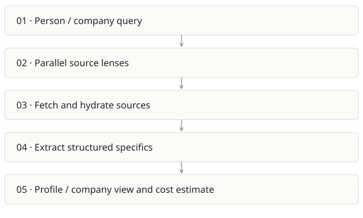

# Researcher

**Recommendation:** Narrow into a sourced briefing feature before making a separate business.

| Snapshot | Assessment |
|---|---|
| Supplied location ID | researcher |
| Product family | Research workflow |
| Implementation stage | Exploratory Next.js implementation |
| Review date | 2026-09-26 |
| Local state | local changes present |

## Vision and the problem it addresses

Build a structured research brief for a person or company by combining multiple search lenses, reference sources and extracted specifics.

**Who needs it:** Analysts, founders and customer-facing teams preparing background research; company due-diligence users with human review.

**The moment it becomes useful:** Research is scattered across tabs and repetitive queries. The user wants a useful, sourced briefing before a meeting or analysis task.

## How it works

This diagram summarizes the inspected design. It is not evidence of a successful end-to-end deployment. For a hands-on journey, use the [onboarding guide](ONBOARDING.md).

## How well it addresses the problem

- runLenses orchestrates parallel reference/search requests and gathers photos, statistics and structured extraction.
- The current working tree adds a company research path, so the local app is broader than the tracked boilerplate README suggests.
- Separating source gathering and extraction creates a useful seam for evidence validation.

These are implementation strengths. Repeated use, customer demand and measured business outcomes remain separate questions.

## What is missing or unproven

- README is the create-next-app boilerplate and does not explain the product, providers, data flow or limitations.
- Public-source aggregation can confuse people with the same name or repeat weak claims. Facts need source/date/confidence and correction handling.
- Person research includes wealth/lifestyle lenses; avoid making sensitive personal inferences or automated eligibility decisions from scraped material.
- No provider-backed run or automated test suite was established. Parallel fan-out increases partial-failure and cost-control needs.

## Smallest useful next step

Focus on company and meeting preparation: three decisions the brief supports, source-linked claims, explicit unknowns and a hard query budget. Remove decorative lenses that do not help those decisions.

**Acceptance exercise:** Use a public company with known reference facts and an ambiguous-name fixture. Verify citations actually support each claim, stale sources are dated, partial provider failures are shown and cost estimates reconcile with provider usage.

This is a proposed validation exercise unless explicitly recorded as executed in [VALIDATION](../../VALIDATION.md).

## Position in the portfolio

Related work: [Spreix Meeting Intelligence](../spreix-notetaker/REPORT.md), [Cortex / compiled wiki](../cortex/REPORT.md), [Spreix Platform](../spreix-platform/REPORT.md).

Read the [overlap and integration decisions](../../portfolio/SYNTHESIS.md) before merging features. Shared vocabulary does not guarantee shared IDs, permissions, storage or lifecycle semantics.

| Reviewer judgment, 1–5 | Score |
|---|---|
| Effort to a credible narrow pilot | 2 |
| Potential breadth and recurrence of the need | 2 |
| Integration, operational and consequence exposure | 3 |

These are ordinal planning judgments, not completion percentages or a commercial valuation. Empty/archive projects should be parked rather than treated as active bets.

## Evidence and next reading

[Source references and snapshot limits](EVIDENCE.md) · [Developer / Claude onboarding](ONBOARDING.md) · [Portfolio synthesis](../../portfolio/SYNTHESIS.md)
