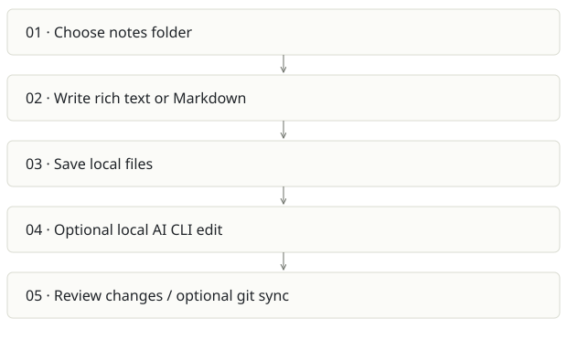

# Scratch

**Recommendation:** Use as a human writing surface; preserve upstream identity.

| Snapshot | Assessment |
|---|---|
| Supplied location ID | scratch |
| Product family | Personal workspace |
| Implementation stage | Established desktop app source |
| Review date | 2026-09-26 |
| Local state | local changes present |

## Vision and the problem it addresses

Offer a fast offline Markdown workspace where the user owns plain files and can invoke local AI editors when needed.

**Who needs it:** Writers and developers who prefer local notes, keyboard workflows and portable Markdown.

**The moment it becomes useful:** A person wants rich editing and search without a cloud account or a heavyweight team knowledge system.

## How it works

This diagram summarizes the inspected design. It is not evidence of a successful end-to-end deployment. For a hands-on journey, use the [onboarding guide](ONBOARDING.md).

## How well it addresses the problem

- The product has a clear boundary: local files and a native Tauri shell with React/TipTap.
- The Rust AI execution path checks for the selected CLI, configures process arguments and streams through a spawned process.
- External file-change support makes it a plausible surface for agent-authored notes without replacing file ownership.

These are implementation strengths. Repeated use, customer demand and measured business outcomes remain separate questions.

## What is missing or unproven

- A personal notes app has no organization-level permission or evidence model by default. Do not treat it as a company brain.
- Launching an AI CLI can expose selected content to the configured provider; offline storage alone does not mean every AI operation stays local.
- Platform builds, permissions, cancellation and concurrent edits need testing on each OS. No native build was run here.
- The upstream project is erictli/scratch; it is not a newly owned Spreix product simply because the checkout is local.

## Smallest useful next step

Pilot a folder-based integration: approved exports from Cairn or Spreix become readable Markdown in Scratch. Keep round-trip ownership explicit and avoid auto-overwriting human edits.

**Acceptance exercise:** Use a disposable note, edit in rich/source mode, reopen the Markdown file, make an external edit and verify refresh, then invoke/cancel a harmless local AI request. Check diffs before saving.

This is a proposed validation exercise unless explicitly recorded as executed in [VALIDATION](../../VALIDATION.md).

## Position in the portfolio

Related work: [Cortex / compiled wiki](../cortex/REPORT.md), [Cairn](../cairn/REPORT.md), [Spreix Brain](../spreix-brain/REPORT.md).

Read the [overlap and integration decisions](../../portfolio/SYNTHESIS.md) before merging features. Shared vocabulary does not guarantee shared IDs, permissions, storage or lifecycle semantics.

| Reviewer judgment, 1–5 | Score |
|---|---|
| Effort to a credible narrow pilot | 2 |
| Potential breadth and recurrence of the need | 2 |
| Integration, operational and consequence exposure | 2 |

These are ordinal planning judgments, not completion percentages or a commercial valuation. Empty/archive projects should be parked rather than treated as active bets.

## Evidence and next reading

[Source references and snapshot limits](EVIDENCE.md) · [Developer / Claude onboarding](ONBOARDING.md) · [Portfolio synthesis](../../portfolio/SYNTHESIS.md)
