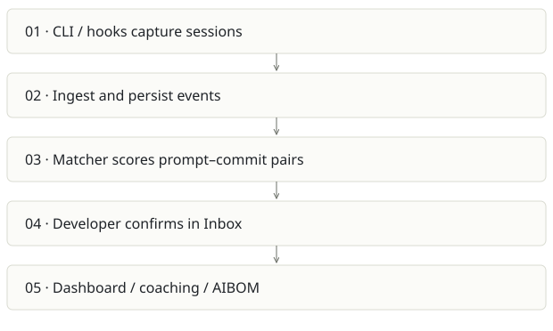

# Prompture

**Recommendation:** Keep as the detailed capture product; consolidate Qmmit direction here.

| Snapshot | Assessment |
|---|---|
| Supplied location ID | sovix-ai |
| Product family | Engineering evidence |
| Implementation stage | Broad implementation |
| Review date | 2026-09-26 |
| Local state | local changes present |

## Vision and the problem it addresses

Turn AI-assisted coding into inspectable evidence: which prompts preceded which commits, what was used, and what a developer or team learned. The meaningful vision is a trusted usage record; a verified portfolio is one possible presentation of it.

**Who needs it:** Developers who want a personal usage history; engineering leads introducing AI; platform or governance teams that need provenance.

**The moment it becomes useful:** A team pays for multiple coding assistants but cannot explain how activity relates to shipped work. Git signatures alone miss manually committed AI-assisted work.

## How it works

This diagram summarizes the inspected design. It is not evidence of a successful end-to-end deployment. For a hands-on journey, use the [onboarding guide](ONBOARDING.md).

## How well it addresses the problem

- The matcher applies author and temporal hard gates before computing signal scores and persisting a match. This is stronger than an unexplained activity score.
- Separate ingest, matcher, worker and web surfaces exist; the README names partial scanner coverage instead of claiming every tool works equally.
- The manual confirmation loop gives users a way to correct attribution rather than treating similarity as proof.

These are implementation strengths. Repeated use, customer demand and measured business outcomes remain separate questions.

## What is missing or unproven

- A scored association is not causal proof that AI produced a change or improved productivity. Precision and recall need a labeled benchmark by tool.
- Capture coverage is uneven: README identifies Copilot detection-only and partial Cursor/Windsurf extraction. Validate current scanner fixtures before making coverage promises.
- Multi-service deployment, identity mapping and provider costs are a sizable burden for a personal portfolio wedge.
- No production availability or AIBOM compliance certification was established in this review. Signing a record establishes integrity, not the truth of its contents.

## Smallest useful next step

Choose one supported tool and one repo; show an end-to-end capture, sync, candidate match, rejection/confirmation and dashboard reconciliation. Publish a coverage matrix with explicit unknowns.

**Acceptance exercise:** Create a synthetic prompt and a known commit in a disposable repo. Confirm the same prompt ID appears once after repeated sync, rejected matches stop contributing to accepted attribution, and tokens match raw capture. Test an unrelated commit as a negative control.

This is a proposed validation exercise unless explicitly recorded as executed in [VALIDATION](../../VALIDATION.md).

## Position in the portfolio

Related work: [Qmmit](../aicommit-/REPORT.md), [Sovix CLI](../sovix-cli/REPORT.md), [Receipts](../github-2/REPORT.md), [Cairn](../cairn/REPORT.md).

Read the [overlap and integration decisions](../../portfolio/SYNTHESIS.md) before merging features. Shared vocabulary does not guarantee shared IDs, permissions, storage or lifecycle semantics.

| Reviewer judgment, 1–5 | Score |
|---|---|
| Effort to a credible narrow pilot | 3 |
| Potential breadth and recurrence of the need | 4 |
| Integration, operational and consequence exposure | 4 |

These are ordinal planning judgments, not completion percentages or a commercial valuation. Empty/archive projects should be parked rather than treated as active bets.

## Evidence and next reading

[Source references and snapshot limits](EVIDENCE.md) · [Developer / Claude onboarding](ONBOARDING.md) · [Portfolio synthesis](../../portfolio/SYNTHESIS.md)
