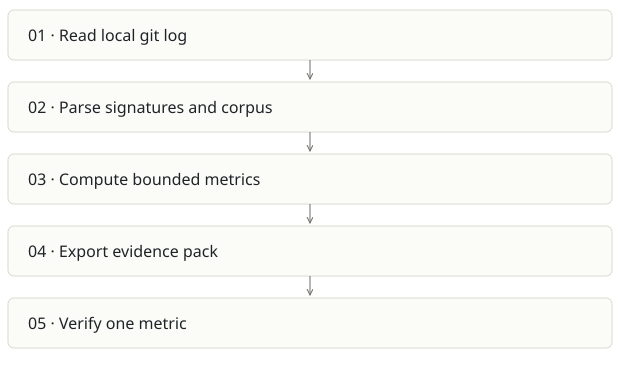

# Sovix CLI

**Recommendation:** Quickest clear distribution wedge.

| Snapshot | Assessment |
|---|---|
| Supplied location ID | sovix-cli |
| Product family | Engineering evidence |
| Implementation stage | Focused tested CLI |
| Review date | 2026-09-26 |
| Local state | clean |

## Vision and the problem it addresses

Give an honest lower bound for agent-signed repository activity with deterministic, inspectable metrics and no model dependency.

**Who needs it:** Engineering leads doing an initial AI-adoption audit; developers wanting a local report; consultants comparing fixed time windows.

**The moment it becomes useful:** A team wants evidence before installing invasive capture agents or giving a service tokens. A local git repository is already available.

## How it works

This diagram summarizes the inspected design. It is not evidence of a successful end-to-end deployment. For a hands-on journey, use the [onboarding guide](ONBOARDING.md).

## How well it addresses the problem

- scanLocal validates a git repository and reads its log without a checkout mutation.
- 153 tests passed in this review, covering arithmetic, privacy, signatures, CLI export and reproducibility.
- Measured/proxy/inferred tiers and caveats are first-class output. Aggregate-only people data is a deliberate product boundary.

These are implementation strengths. Repeated use, customer demand and measured business outcomes remain separate questions.

## What is missing or unproven

- Unsigned AI-assisted work is invisible. A low number can mean low capture coverage, not low adoption.
- Commits, lines and timing are not business productivity or quality. Comparisons need the same window, repository rules and sample exclusions.
- README explicitly says pre-1.0 and not on npm; a copy-paste npx command is not a verified distribution path here.
- It overlaps strongly with Receipts; two separate metric definitions would drift.

## Smallest useful next step

Use the checked-out CLI for a clean example report, verify deterministic output twice and document installation honestly. Keep it as a small front door to the broader evidence product.

**Acceptance exercise:** Run npm test. Then node bin/sovix.js scan <fixture-repo> --json and export with the same fixed since date twice. Introduce known signed/unsigned/merge/bot commits and verify denominators and privacy.

This is a proposed validation exercise unless explicitly recorded as executed in [VALIDATION](../../VALIDATION.md).

## Position in the portfolio

Related work: [Receipts](../github-2/REPORT.md), [Prompture](../sovix-ai/REPORT.md), [Qmmit](../aicommit-/REPORT.md).

Read the [overlap and integration decisions](../../portfolio/SYNTHESIS.md) before merging features. Shared vocabulary does not guarantee shared IDs, permissions, storage or lifecycle semantics.

| Reviewer judgment, 1–5 | Score |
|---|---|
| Effort to a credible narrow pilot | 1 |
| Potential breadth and recurrence of the need | 3 |
| Integration, operational and consequence exposure | 1 |

These are ordinal planning judgments, not completion percentages or a commercial valuation. Empty/archive projects should be parked rather than treated as active bets.

## Evidence and next reading

[Source references and snapshot limits](EVIDENCE.md) · [Developer / Claude onboarding](ONBOARDING.md) · [Portfolio synthesis](../../portfolio/SYNTHESIS.md)
