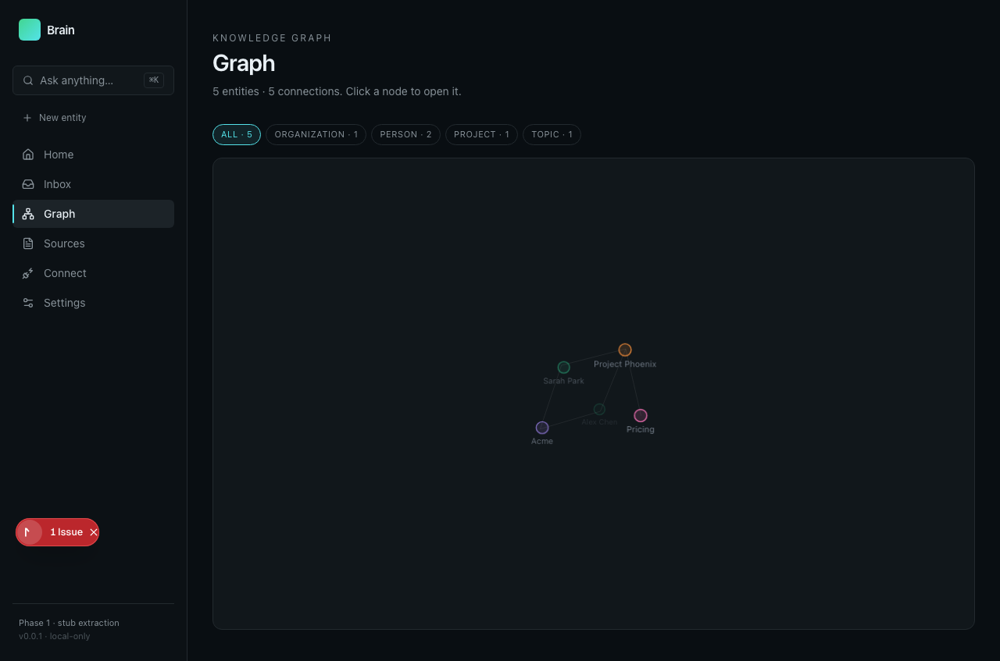

# Onboarding: Spreix Brain

**Goal:** understand one useful workflow, prove its result and know which responsibilities belong to the developer versus Claude.

## Environment and first start

Follow README local Postgres/Redis, Prisma generation/schema and worker. Use synthetic local Markdown first. Existing onboarding screenshots are historical evidence rather than proof of the current deployment.

Use the original repository’s README and local agent instructions for exact environment configuration. This report records the inspected snapshot; provider availability, credentials and external services were not assumed to work. Begin with synthetic data and the smallest complete workflow below.

## Interface journey

The steps describe expected behavior from the inspected implementation/documentation. They are a validation script, not a claim that every click was exercised. Actual checks are listed in [VALIDATION](../../VALIDATION.md).

| Step | Developer / user action | What should be observable |
|---|---|---|
| 1. Connect a fixture | Use onboarding to ingest a small local Markdown source. | The source status and extraction mode are visible. |
| 2. Resolve ambiguity | Open the clarification Inbox and review a mid-confidence entity. | Accepting the suggestion updates the correct entity with source provenance. |
| 3. Browse knowledge | Open Entities and Graph, then inspect the source of a relationship. | The entity reflects a real extraction; stub mode must not look like a provider-backed result. |

Historical repository screenshot, not a current runtime check. The screen explicitly says “Phase 1 — stub extraction”; the five-entity fixture and issue badge must not be presented as a production success.

## What Claude should do

Claude can explain entity provenance and build connectors. Do not assume Claude receives session memory automatically; the inspected app’s agent interaction differs from Cairn’s hooks.

A useful starting instruction is: “Help me complete the first workflow in this guide. Check the current README and configuration, identify any unavailable dependency, show the source evidence behind the result, and run the relevant acceptance check. Distinguish what you observed from what you inferred.”

If a tool or provider fails, Claude should name the failed dependency, preserve successful intermediate work and report the degraded state. It should not replace an unavailable result with a confident-looking invented answer. A screenshot, generated summary or green counter is evidence of only the state it actually shows.

## Use it by role

| Role | First objective | Evidence of value |
|---|---|---|
| End user / individual developer | Complete the three-step journey for the problem below | A useful result whose supporting source can be checked |
| Implementing developer | Trace input → transformation → persistence/output; then test failure and replay | Correct identifiers, no silent duplicate work, actionable error state |
| Reviewer / team lead | Challenge one result and inspect its derivation | Corrections survive the next run and limitations stay visible |
| Owner / operator | Prove setup, scope, permissions and cost behavior in the intended environment | Repeatable operation without hidden manual repair |
| Claude / coding assistant | Follow the repository-specific role described above | Real tool results, scoped changes, explicit verification and no invented evidence |

The concrete user problem is: Raw notes know facts, but cannot reliably answer which person owns which decision across documents and code.

## Validate that it works

In a fixture, ingest the same hashed document twice, then a changed version. Verify no duplicate entities, a mid-confidence item enters Inbox, acceptance updates provenance and provider failure is labeled. Run DB tests against an isolated test database.

Keep a small record: source revision, fixture/input ID, command or UI action, expected output, actual output and failure details. Test presence and code inspection are not substitutes for running this exercise. Current demonstrated strengths and gaps are in the [report](REPORT.md).

## Measure usefulness and savings

No measured financial ROI was established for this project. Time yourself completing the same meaningful task manually and with the tool; include setup amortization, correction/review time, provider charges and retry/support time. Compare accepted results of similar quality. A higher activity count is not automatically higher productivity.

For this project, begin with its smallest useful experiment: Use the clarification inbox as the differentiating slice. Add an explicit extraction-mode badge, enforce source hashes and complete tenant auth before expanding connectors.

The [Cairn savings guide](../../onboarding/CAIRN.md) explains the distinction between context compression, added cost and measured task outcomes. Its dollar example is hypothetical and should not be reused as this product’s ROI.

## Read next

[Report](REPORT.md) · [Evidence](EVIDENCE.md) · [Portfolio boundaries](../../portfolio/SYNTHESIS.md)
