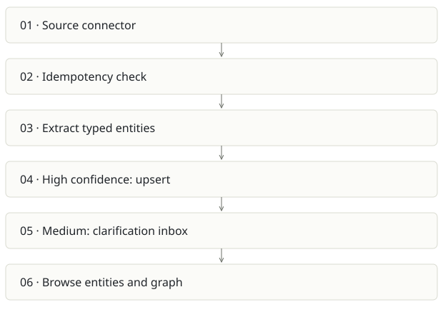

# Spreix Brain

**Recommendation:** Keep as a product experiment; port the uncertainty inbox.

| Snapshot | Assessment |
|---|---|
| Supplied location ID | spreix-brain |
| Product family | Team knowledge |
| Implementation stage | Focused MVP |
| Review date | 2026-09-26 |
| Local state | local changes present |

## Vision and the problem it addresses

Turn work sources into typed people, projects, decisions and related entities, asking humans when extraction is uncertain.

**Who needs it:** Individuals and small teams who want meeting prep, source-linked entity pages and manageable clarification tasks.

**The moment it becomes useful:** Raw notes know facts, but cannot reliably answer which person owns which decision across documents and code.

## How it works

This diagram summarizes the inspected design. It is not evidence of a successful end-to-end deployment. For a hands-on journey, use the [onboarding guide](ONBOARDING.md).

## How well it addresses the problem

- ingestSource skips unchanged completed source hashes, marks processing/done/failed, and branches by confidence.
- Typed entity extraction and a clarification inbox are more concrete than “chat with everything.”
- A code connector exists; stored screenshots and e2e flows cover onboarding, entities, graph and inbox.

These are implementation strengths. Repeated use, customer demand and measured business outcomes remain separate questions.

## What is missing or unproven

- README explicitly defers auth/billing despite mentioning Clerk and Stripe in the stack; do not market the MVP as ready multitenant SaaS.
- Extraction tests intentionally fall back to a stub on provider failure. UI and provenance must make degraded/demo extraction unmistakable.
- The idempotency check defaults a missing contentHash to an empty string. Connectors must consistently supply hashes or changed content can appear unchanged.
- This review ran 52 tests: 47 passed, 5 code-ingest tests could not reach the configured database on 5433. Full runtime success remains unverified.

## Smallest useful next step

Use the clarification inbox as the differentiating slice. Add an explicit extraction-mode badge, enforce source hashes and complete tenant auth before expanding connectors.

**Acceptance exercise:** In a fixture, ingest the same hashed document twice, then a changed version. Verify no duplicate entities, a mid-confidence item enters Inbox, acceptance updates provenance and provider failure is labeled. Run DB tests against an isolated test database.

This is a proposed validation exercise unless explicitly recorded as executed in [VALIDATION](../../VALIDATION.md).

## Position in the portfolio

Related work: [Spreix Platform](../spreix-platform/REPORT.md), [Cortex / compiled wiki](../cortex/REPORT.md), [kb code graph](../kb/REPORT.md), [Spreix Company Brain](../spreix-company-brain/REPORT.md).

Read the [overlap and integration decisions](../../portfolio/SYNTHESIS.md) before merging features. Shared vocabulary does not guarantee shared IDs, permissions, storage or lifecycle semantics.

| Reviewer judgment, 1–5 | Score |
|---|---|
| Effort to a credible narrow pilot | 2 |
| Potential breadth and recurrence of the need | 3 |
| Integration, operational and consequence exposure | 3 |

These are ordinal planning judgments, not completion percentages or a commercial valuation. Empty/archive projects should be parked rather than treated as active bets.

## Evidence and next reading

[Source references and snapshot limits](EVIDENCE.md) · [Developer / Claude onboarding](ONBOARDING.md) · [Portfolio synthesis](../../portfolio/SYNTHESIS.md)
