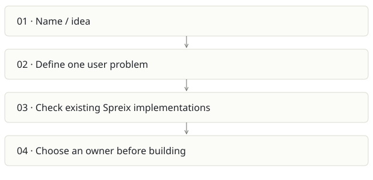

# Spreix Company Brain

**Recommendation:** Reserve the name; do not start another implementation.

| Snapshot | Assessment |
|---|---|
| Supplied location ID | spreix-company-brain |
| Product family | Team knowledge |
| Implementation stage | Empty directory |
| Review date | 2026-09-26 |
| Local state | not a git checkout |

## Vision and the problem it addresses

The name suggests an organization-wide memory product, but the supplied directory contains no implementation, README, requirements or history. Any more specific vision would be invented.

**Who needs it:** Potentially teams seeking shared organizational knowledge; this is a hypothesis, not a documented target user.

**The moment it becomes useful:** Only choose a new project if a validated user need cannot be served by Spreix Platform or Spreix Brain.

## How it works

This diagram summarizes the inspected design. It is not evidence of a successful end-to-end deployment. For a hands-on journey, use the [onboarding guide](ONBOARDING.md).

## How well it addresses the problem

- The empty directory is clear evidence of zero local implementation. It is useful to expose this instead of counting it as another product.

These are implementation strengths. Repeated use, customer demand and measured business outcomes remain separate questions.

## What is missing or unproven

- No code, UI, tests, setup, feature set or adoption evidence exists at the supplied path.
- A second company-brain product would duplicate identity, ingestion and knowledge ownership unless its boundary is explicit.

## Smallest useful next step

Add a one-page decision record pointing to the chosen canonical Spreix repository. Keep this folder as a pointer or retire the concept after reviewing naming needs.

**Acceptance exercise:** There is nothing runnable to validate. The next validation is a user interview and an explicit build/merge/park decision, not a smoke test.

This is a proposed validation exercise unless explicitly recorded as executed in [VALIDATION](../../VALIDATION.md).

## Position in the portfolio

Related work: [Spreix Platform](../spreix-platform/REPORT.md), [Spreix Brain](../spreix-brain/REPORT.md), [Cortex / compiled wiki](../cortex/REPORT.md).

Read the [overlap and integration decisions](../../portfolio/SYNTHESIS.md) before merging features. Shared vocabulary does not guarantee shared IDs, permissions, storage or lifecycle semantics.

| Reviewer judgment, 1–5 | Score |
|---|---|
| Effort to a credible narrow pilot | 1 |
| Potential breadth and recurrence of the need | 1 |
| Integration, operational and consequence exposure | 1 |

These are ordinal planning judgments, not completion percentages or a commercial valuation. Empty/archive projects should be parked rather than treated as active bets.

## Evidence and next reading

[Source references and snapshot limits](EVIDENCE.md) · [Developer / Claude onboarding](ONBOARDING.md) · [Portfolio synthesis](../../portfolio/SYNTHESIS.md)
