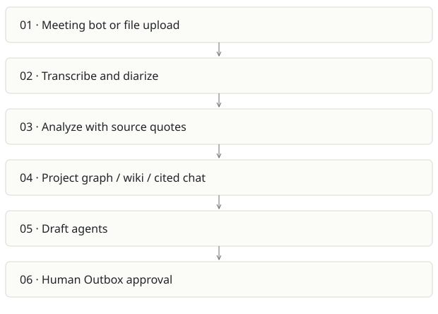

# Spreix Meeting Intelligence

**Recommendation:** Strongest concrete team workflow; narrow the promise around reliable follow-through.

| Snapshot | Assessment |
|---|---|
| Supplied location ID | spreix-notetaker |
| Product family | Team knowledge |
| Implementation stage | Broad product implementation |
| Review date | 2026-09-26 |
| Local state | local changes present |

## Vision and the problem it addresses

Capture meetings, turn speech into cited knowledge and help teams act through reviewed outputs. The recurring value is decisions and follow-through across meetings.

**Who needs it:** Project teams, customer-facing teams, managers and operations staff working across meeting platforms.

**The moment it becomes useful:** Decisions disappear in recordings, action owners are ambiguous, and follow-up documents take too long to prepare.

## How it works

This diagram summarizes the inspected design. It is not evidence of a successful end-to-end deployment. For a hands-on journey, use the [onboarding guide](ONBOARDING.md).

## How well it addresses the problem

- The inspected analysis pipeline handles existing processing/completed analysis, refreshes expiring media access and passes participant names and custom vocabulary.
- Provider-call failure updates the analysis/recording to failed, giving the UI a retry path.
- README and roadmap describe an Outbox approval boundary, API cost metering and corrected transcript reuse across outputs.

These are implementation strengths. Repeated use, customer demand and measured business outcomes remain separate questions.

## What is missing or unproven

- The inspected fire-and-forget HTTP kickoff can lose work on process termination unless an external durable retry path covers it. Audit the whole call chain before treating kickoff as durable.
- Check-then-create idempotency needs concurrency validation; two simultaneous calls can pass an application-level check.
- The broad feature surface includes bots, media, graph, wiki, conflicts, billing and exports. Each adds operational and privacy obligations.
- README states billing fails open when Stripe keys are absent. Deployment checks must make intentional free mode distinct from misconfigured paid production.

## Smallest useful next step

Prove one 30-minute meeting journey: reliable capture, corrected names, cited action owners, human-reviewed draft and successful export. Track retries and fully loaded cost per successful meeting hour.

**Acceptance exercise:** Use a consented synthetic recording with known names, a decision reversal and action items. Check transcription corrections propagate to exports/chat, duplicate callbacks do not duplicate analyses, and discard never sends an Outbox draft. No external message was sent in this review.

This is a proposed validation exercise unless explicitly recorded as executed in [VALIDATION](../../VALIDATION.md).

## Position in the portfolio

Related work: [Spreix Platform](../spreix-platform/REPORT.md), [Cortex / compiled wiki](../cortex/REPORT.md), [Spreix Brain](../spreix-brain/REPORT.md), [Lumen](../ragpipeline/REPORT.md).

Read the [overlap and integration decisions](../../portfolio/SYNTHESIS.md) before merging features. Shared vocabulary does not guarantee shared IDs, permissions, storage or lifecycle semantics.

| Reviewer judgment, 1–5 | Score |
|---|---|
| Effort to a credible narrow pilot | 2 |
| Potential breadth and recurrence of the need | 5 |
| Integration, operational and consequence exposure | 4 |

These are ordinal planning judgments, not completion percentages or a commercial valuation. Empty/archive projects should be parked rather than treated as active bets.

## Evidence and next reading

[Source references and snapshot limits](EVIDENCE.md) · [Developer / Claude onboarding](ONBOARDING.md) · [Portfolio synthesis](../../portfolio/SYNTHESIS.md)
