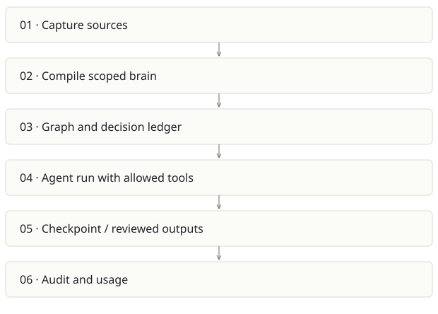

# Spreix Platform

**Recommendation:** Largest team-product upside and largest scope risk.

| Snapshot | Assessment |
|---|---|
| Supplied location ID | spreix-platform |
| Product family | Team knowledge |
| Implementation stage | Consolidated implementation; deployment unverified |
| Review date | 2026-09-26 |
| Local state | clean |

## Vision and the problem it addresses

Unify capture, compiled team memory and useful actions into a multi-tenant work system: meetings and documents become cited knowledge, decisions and controlled agent runs.

**Who needs it:** Teams that repeatedly need shared context across meetings, projects and tools; admins managing scoped knowledge and actions.

**The moment it becomes useful:** Notetakers, wikis and automations are separate. Teams lose provenance when information moves between them, and repeatedly rebuild context before acting.

## How it works

This diagram summarizes the inspected design. It is not evidence of a successful end-to-end deployment. For a hands-on journey, use the [onboarding guide](ONBOARDING.md).

## How well it addresses the problem

- The inspected agent worker wires a real runAgent implementation, persistent memory, checkpoints, outputs and realtime events.
- External tool discovery is best-effort and the agent definition still narrows its allowed tool belt.
- The codebase contains extensive router/worker/package tests and explicit org/brain scope concepts. This is not just the design plan described by the opening README.

These are implementation strengths. Repeated use, customer demand and measured business outcomes remain separate questions.

## What is missing or unproven

- README has materially stale architecture: it says design-only and Aurora while later text/AGENTS describes standard Postgres/Neon and source contains implemented workers.
- An external-tool discovery failure silently degrades to core tools after logging; users need to understand which capability was unavailable.
- Ported code does not guarantee feature parity. Auth, provenance, schema and event semantics differ among the source products.
- No fresh cloud deployment or full product acceptance pass was done here. Historical AGENTS deployment gaps may themselves be stale; resolve against the current runbook and real environment.

## Smallest useful next step

Pick one paid workflow: meeting decision to living project brief to approved task. Establish the canonical knowledge store and cut the launch surface to that loop before adding more channels.

**Acceptance exercise:** Use two fixture organizations, replay a source event, run an agent with one allowed and one forbidden tool, interrupt/resume from a checkpoint, and validate every resulting artifact’s source lineage and tenant scope. Then run the same test against a deployed dev stage.

This is a proposed validation exercise unless explicitly recorded as executed in [VALIDATION](../../VALIDATION.md).

## Position in the portfolio

Related work: [Spreix Meeting Intelligence](../spreix-notetaker/REPORT.md), [Cortex / compiled wiki](../cortex/REPORT.md), [Spreix Brain](../spreix-brain/REPORT.md), [Spreix Company Brain](../spreix-company-brain/REPORT.md), [Lumen](../ragpipeline/REPORT.md).

Read the [overlap and integration decisions](../../portfolio/SYNTHESIS.md) before merging features. Shared vocabulary does not guarantee shared IDs, permissions, storage or lifecycle semantics.

| Reviewer judgment, 1–5 | Score |
|---|---|
| Effort to a credible narrow pilot | 4 |
| Potential breadth and recurrence of the need | 5 |
| Integration, operational and consequence exposure | 5 |

These are ordinal planning judgments, not completion percentages or a commercial valuation. Empty/archive projects should be parked rather than treated as active bets.

## Evidence and next reading

[Source references and snapshot limits](EVIDENCE.md) · [Developer / Claude onboarding](ONBOARDING.md) · [Portfolio synthesis](../../portfolio/SYNTHESIS.md)
